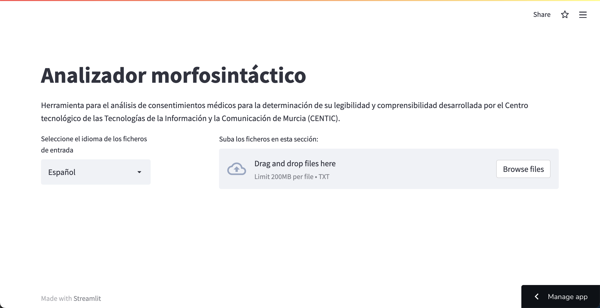

# NLP Project

This project aims to help determine how *legible* and 
*understandable* are medical consents in **Spanish and Catalan**.

This was developed in colaboration with the *University of Murcia* (UMU) and 
*Universitat Jaume I* (UJI)

You can check the final version online on [Streamlit](https://share.streamlit.io/centicmurcia/nlp-consentimientos-medicos/webapp_dev/app.py). 
(Low processing power)

## Usage

Just upload a few .txt files to extract it's metrics and analyze them with 
the tool.

This will extract a bunch of metrics and will perform some basic ML
algorithms (PCA and TSNE) to group the texts with common features.